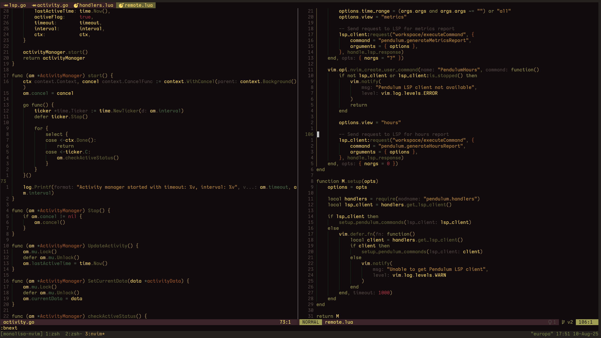

<h1 align="center">MonaLisa</h1>

<p align="center">A dark and colorful theme for Neovim</p>



Inspired by the painting and the iterm2 theme.


## Installation

`lazy.nvim`:
```lua
{
    "ptdewey/monalisa-nvim",
    priority = 1000,
}
```

`vim.pack`:
```lua
vim.pack.add({ "https://github.com/ptdewey/monalisa-nvim" })
```

## Usage

Basic usage:
```lua
vim.cmd.colorscheme("monalisa")
```

With configuration:
```lua
require("monalisa").setup({
    transparent = false,    -- Enable transparent backgrounds
    terminal_colors = true, -- Set terminal colors (0-15)
    italics = true,         -- Enable italic styling
    overrides = {},         -- Highlight group overrides
})
vim.cmd.colorscheme("monalisa")
```

### Disabling Italics

To disable all italic styling:
```lua
require("monalisa").setup({
    italics = false,
})
vim.cmd.colorscheme("monalisa")
```

### Transparent Background

To enable transparent background (useful for terminal transparency):
```lua
require("monalisa").setup({
    transparent = true,
})
vim.cmd.colorscheme("monalisa")
```

### Custom Overrides

You can override specific highlight groups:
```lua
require("monalisa").setup({
    overrides = {
        Comment = { fg = "#888888", italic = false },
        LineNr = { fg = "#555555" },
    },
})
vim.cmd.colorscheme("monalisa")
```

## Project Structure

```
lua/
├── monalisa/
│   ├── init.lua        # Main entry point with setup() and load()
│   ├── config.lua      # Configuration options
│   ├── palette.lua     # Color definitions
│   └── groups/
│       ├── editor.lua      # Core editor highlights
│       ├── syntax.lua      # Syntax highlighting
│       ├── treesitter.lua  # Treesitter captures
│       ├── lsp.lua         # LSP & diagnostics
│       └── plugins.lua     # Plugin integrations
colors/
└── monalisa.lua        # Simple loader
```

## Supported Plugins

- Telescope
- FzfLua
- GitSigns
- Indent Blankline
- Mini.nvim
- Neo-tree
- Lazy.nvim
- Mason
- Which-key
- Trouble.nvim
- flash.nvim
- Blink.cmp
- Noice
- snacks.nvim

## Contributing

This colorscheme is written in pure Lua. To modify colors, edit the files in `lua/monalisa/`:

- `palette.lua` - Color definitions
- `groups/*.lua` - Highlight group definitions

Format with [StyLua](https://github.com/JohnnyMorganz/StyLua):
```bash
stylua lua/
```
